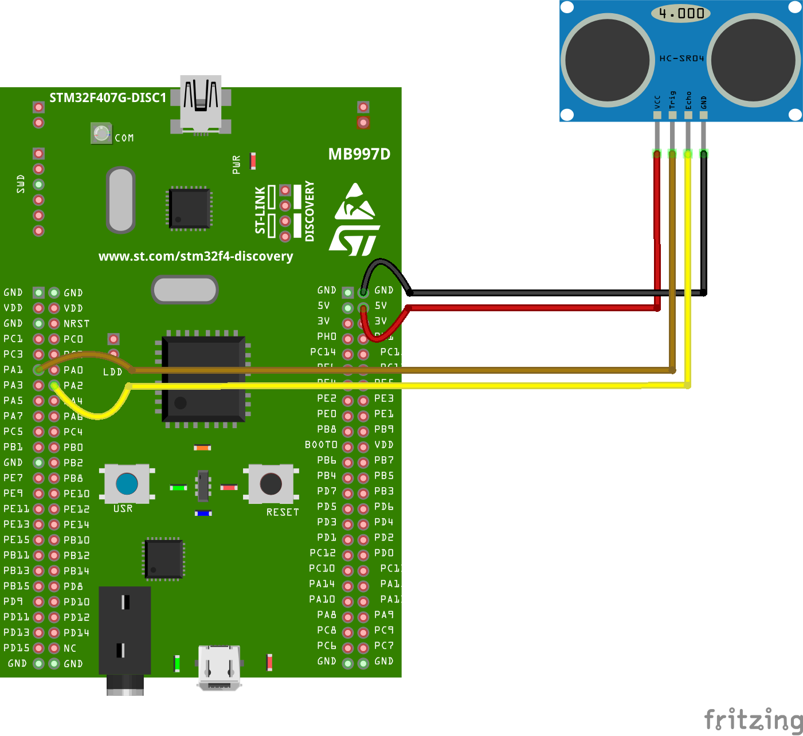

# STM32 HCSR04
## Circuit


## Code
```c++
/* USER CODE BEGIN Header */
/**
  ******************************************************************************
  * @file           : main.c
  * @brief          : Main program body
  ******************************************************************************
  * @attention
  *
  * Copyright (c) 2024 STMicroelectronics.
  * All rights reserved.
  *
  * This software is licensed under terms that can be found in the LICENSE file
  * in the root directory of this software component.
  * If no LICENSE file comes with this software, it is provided AS-IS.
  *
  ******************************************************************************
  */
/* USER CODE END Header */
/* Includes ------------------------------------------------------------------*/
#include "main.h"

/* Private includes ----------------------------------------------------------*/
/* USER CODE BEGIN Includes */

#include "dwt_stm32_delay.h"

/* USER CODE END Includes */

/* Private typedef -----------------------------------------------------------*/
/* USER CODE BEGIN PTD */

/* USER CODE END PTD */

/* Private define ------------------------------------------------------------*/
/* USER CODE BEGIN PD */

/* USER CODE END PD */

/* Private macro -------------------------------------------------------------*/
/* USER CODE BEGIN PM */

/* USER CODE END PM */

/* Private variables ---------------------------------------------------------*/

/* USER CODE BEGIN PV */

/* USER CODE END PV */

/* Private function prototypes -----------------------------------------------*/
void SystemClock_Config(void);
static void MX_GPIO_Init(void);
/* USER CODE BEGIN PFP */

/* USER CODE END PFP */

/* Private user code ---------------------------------------------------------*/
/* USER CODE BEGIN 0 */

////////////////////////////////////-> USER SETTINGS
#define TRIG_PIN 	GPIO_PIN_1
#define ECHO_PIN 	GPIO_PIN_2

#define TRIG_PORT 	GPIOA
#define ECHO_PORT 	GPIOA
///////////////////////////////////

uint32_t time;
uint16_t distance;

uint32_t Read_HCSR04()
{
	uint32_t local_time = 0;                            	//-> It is us timer

	HAL_GPIO_WritePin(TRIG_PORT, TRIG_PIN, GPIO_PIN_SET);
	DWT_Delay_us(10);                                		//-> Delay 10us
	HAL_GPIO_WritePin(TRIG_PORT, TRIG_PIN, GPIO_PIN_RESET);

	while(!HAL_GPIO_ReadPin(ECHO_PORT, ECHO_PIN));      	//-> Wait to echo pin

	while(HAL_GPIO_ReadPin(ECHO_PORT, ECHO_PIN))        	//-> Coming to data from echo pin
	{
		local_time++;
		DWT_Delay_us(1);                                	//-> Delay 1us
	}

	return local_time;
}

/* USER CODE END 0 */

/**
  * @brief  The application entry point.
  * @retval int
  */
int main(void)
{

  /* USER CODE BEGIN 1 */

  /* USER CODE END 1 */

  /* MCU Configuration--------------------------------------------------------*/

  /* Reset of all peripherals, Initializes the Flash interface and the Systick. */
  HAL_Init();

  /* USER CODE BEGIN Init */

  /* USER CODE END Init */

  /* Configure the system clock */
  SystemClock_Config();

  /* USER CODE BEGIN SysInit */

  /* USER CODE END SysInit */

  /* Initialize all configured peripherals */
  MX_GPIO_Init();
  /* USER CODE BEGIN 2 */

  DWT_Delay_Init();

  /* USER CODE END 2 */

  /* Infinite loop */
  /* USER CODE BEGIN WHILE */
  while (1)
  {
    /* USER CODE END WHILE */
    /* USER CODE BEGIN 3 */

	time = Read_HCSR04();
	distance = time * 0.034 / 2;
	HAL_Delay(50);
	if (distance <= 6)
	{
		HAL_GPIO_WritePin(GPIOD, GPIO_PIN_12, GPIO_PIN_RESET);
		HAL_GPIO_WritePin(GPIOD, GPIO_PIN_13, GPIO_PIN_RESET);
		HAL_GPIO_WritePin(GPIOD, GPIO_PIN_14, GPIO_PIN_RESET);
		HAL_GPIO_WritePin(GPIOD, GPIO_PIN_15, GPIO_PIN_RESET);
	}
	if(distance >= 6 && distance < 12)
	{
		HAL_GPIO_WritePin(GPIOD, GPIO_PIN_12, GPIO_PIN_SET);
		HAL_GPIO_WritePin(GPIOD, GPIO_PIN_13, GPIO_PIN_RESET);
		HAL_GPIO_WritePin(GPIOD, GPIO_PIN_14, GPIO_PIN_RESET);
		HAL_GPIO_WritePin(GPIOD, GPIO_PIN_15, GPIO_PIN_RESET);
	}
	else if(distance >= 12 && distance < 18)
	{
		HAL_GPIO_WritePin(GPIOD, GPIO_PIN_12, GPIO_PIN_SET);
		HAL_GPIO_WritePin(GPIOD, GPIO_PIN_13, GPIO_PIN_SET);
		HAL_GPIO_WritePin(GPIOD, GPIO_PIN_14, GPIO_PIN_RESET);
		HAL_GPIO_WritePin(GPIOD, GPIO_PIN_15, GPIO_PIN_RESET);
	}
	else if(distance >= 18 && distance < 24)
	{
		HAL_GPIO_WritePin(GPIOD, GPIO_PIN_12, GPIO_PIN_SET);
		HAL_GPIO_WritePin(GPIOD, GPIO_PIN_13, GPIO_PIN_SET);
		HAL_GPIO_WritePin(GPIOD, GPIO_PIN_14, GPIO_PIN_SET);
		HAL_GPIO_WritePin(GPIOD, GPIO_PIN_15, GPIO_PIN_RESET);
	}
	else if(distance >= 24)
	{
		HAL_GPIO_WritePin(GPIOD, GPIO_PIN_12, GPIO_PIN_SET);
		HAL_GPIO_WritePin(GPIOD, GPIO_PIN_13, GPIO_PIN_SET);
		HAL_GPIO_WritePin(GPIOD, GPIO_PIN_14, GPIO_PIN_SET);
		HAL_GPIO_WritePin(GPIOD, GPIO_PIN_15, GPIO_PIN_SET);
	}
  }
  /* USER CODE END 3 */
}

/**
  * @brief System Clock Configuration
  * @retval None
  */
void SystemClock_Config(void)
{
  RCC_OscInitTypeDef RCC_OscInitStruct = {0};
  RCC_ClkInitTypeDef RCC_ClkInitStruct = {0};

  /** Configure the main internal regulator output voltage
  */
  __HAL_RCC_PWR_CLK_ENABLE();
  __HAL_PWR_VOLTAGESCALING_CONFIG(PWR_REGULATOR_VOLTAGE_SCALE1);

  /** Initializes the RCC Oscillators according to the specified parameters
  * in the RCC_OscInitTypeDef structure.
  */
  RCC_OscInitStruct.OscillatorType = RCC_OSCILLATORTYPE_HSE;
  RCC_OscInitStruct.HSEState = RCC_HSE_ON;
  RCC_OscInitStruct.PLL.PLLState = RCC_PLL_ON;
  RCC_OscInitStruct.PLL.PLLSource = RCC_PLLSOURCE_HSE;
  RCC_OscInitStruct.PLL.PLLM = 4;
  RCC_OscInitStruct.PLL.PLLN = 168;
  RCC_OscInitStruct.PLL.PLLP = RCC_PLLP_DIV2;
  RCC_OscInitStruct.PLL.PLLQ = 7;
  if (HAL_RCC_OscConfig(&RCC_OscInitStruct) != HAL_OK)
  {
    Error_Handler();
  }

  /** Initializes the CPU, AHB and APB buses clocks
  */
  RCC_ClkInitStruct.ClockType = RCC_CLOCKTYPE_HCLK|RCC_CLOCKTYPE_SYSCLK
                              |RCC_CLOCKTYPE_PCLK1|RCC_CLOCKTYPE_PCLK2;
  RCC_ClkInitStruct.SYSCLKSource = RCC_SYSCLKSOURCE_PLLCLK;
  RCC_ClkInitStruct.AHBCLKDivider = RCC_SYSCLK_DIV1;
  RCC_ClkInitStruct.APB1CLKDivider = RCC_HCLK_DIV4;
  RCC_ClkInitStruct.APB2CLKDivider = RCC_HCLK_DIV2;

  if (HAL_RCC_ClockConfig(&RCC_ClkInitStruct, FLASH_LATENCY_5) != HAL_OK)
  {
    Error_Handler();
  }
}

/**
  * @brief GPIO Initialization Function
  * @param None
  * @retval None
  */
static void MX_GPIO_Init(void)
{
  GPIO_InitTypeDef GPIO_InitStruct = {0};
/* USER CODE BEGIN MX_GPIO_Init_1 */
/* USER CODE END MX_GPIO_Init_1 */

  /* GPIO Ports Clock Enable */
  __HAL_RCC_GPIOH_CLK_ENABLE();
  __HAL_RCC_GPIOA_CLK_ENABLE();
  __HAL_RCC_GPIOD_CLK_ENABLE();

  /*Configure GPIO pin Output Level */
  HAL_GPIO_WritePin(GPIOA, GPIO_PIN_1, GPIO_PIN_RESET);

  /*Configure GPIO pin Output Level */
  HAL_GPIO_WritePin(GPIOD, GPIO_PIN_12|GPIO_PIN_13|GPIO_PIN_14|GPIO_PIN_15, GPIO_PIN_RESET);

  /*Configure GPIO pin : PA1 */
  GPIO_InitStruct.Pin = GPIO_PIN_1;
  GPIO_InitStruct.Mode = GPIO_MODE_OUTPUT_PP;
  GPIO_InitStruct.Pull = GPIO_NOPULL;
  GPIO_InitStruct.Speed = GPIO_SPEED_FREQ_LOW;
  HAL_GPIO_Init(GPIOA, &GPIO_InitStruct);

  /*Configure GPIO pin : PA2 */
  GPIO_InitStruct.Pin = GPIO_PIN_2;
  GPIO_InitStruct.Mode = GPIO_MODE_INPUT;
  GPIO_InitStruct.Pull = GPIO_NOPULL;
  HAL_GPIO_Init(GPIOA, &GPIO_InitStruct);

  /*Configure GPIO pins : PD12 PD13 PD14 PD15 */
  GPIO_InitStruct.Pin = GPIO_PIN_12|GPIO_PIN_13|GPIO_PIN_14|GPIO_PIN_15;
  GPIO_InitStruct.Mode = GPIO_MODE_OUTPUT_PP;
  GPIO_InitStruct.Pull = GPIO_NOPULL;
  GPIO_InitStruct.Speed = GPIO_SPEED_FREQ_LOW;
  HAL_GPIO_Init(GPIOD, &GPIO_InitStruct);

/* USER CODE BEGIN MX_GPIO_Init_2 */
/* USER CODE END MX_GPIO_Init_2 */
}

/* USER CODE BEGIN 4 */

/* USER CODE END 4 */

/**
  * @brief  This function is executed in case of error occurrence.
  * @retval None
  */
void Error_Handler(void)
{
  /* USER CODE BEGIN Error_Handler_Debug */
  /* User can add his own implementation to report the HAL error return state */
  __disable_irq();
  while (1)
  {
  }
  /* USER CODE END Error_Handler_Debug */
}

#ifdef  USE_FULL_ASSERT
/**
  * @brief  Reports the name of the source file and the source line number
  *         where the assert_param error has occurred.
  * @param  file: pointer to the source file name
  * @param  line: assert_param error line source number
  * @retval None
  */
void assert_failed(uint8_t *file, uint32_t line)
{
  /* USER CODE BEGIN 6 */
  /* User can add his own implementation to report the file name and line number,
     ex: printf("Wrong parameters value: file %s on line %d\r\n", file, line) */
  /* USER CODE END 6 */
}
#endif /* USE_FULL_ASSERT */
```
